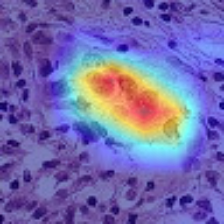
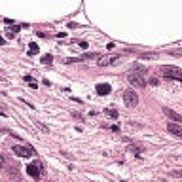
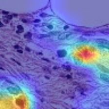
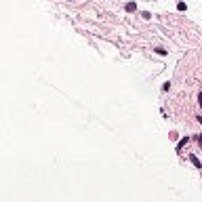
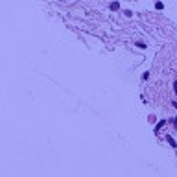

# 🔬 LAAFI_AI — Détection de Métastases sur PatchCamelyon


> Classification binaire de métastases du cancer du sein sur images histopathologiques avec ResNet50.
> Projet portfolio — **ne pas utiliser pour un diagnostic clinique réel**.

---

## 📋 Contexte

Les pathologistes analysent des lames histopathologiques de ganglions lymphatiques pour détecter la présence de métastases. Ce processus est long, répétitif et sujet aux erreurs humaines, en particulier pour les micro-métastases.

Ce projet construit un pipeline de deep learning pour automatiser le screening de patches tissulaires issus du dataset [PatchCamelyon](https://huggingface.co/datasets/1aurent/PatchCamelyon) (327 680 images de 96×96 px, coloration H&E).

## 🧠 Méthode

| Étape | Description |
|---|---|
| **Modèle** | ResNet50 pré-entraîné sur ImageNet |
| **Phase 1** | Feature extraction — backbone gelé, seul le classifieur s'entraîne (5 époques) |
| **Phase 2** | Fine-tuning partiel — layer4 dégelé pour adapter les features au domaine médical (10 époques) |
| **Augmentations** | Flip H/V, rotation ±20°, jitter de couleur |
| **Loss** | BCEWithLogitsLoss |
| **Optimiseur** | AdamW (lr=1e-3, weight_decay=1e-4) |
| **Mixed Precision** | Activé (FP16 sur GPU) |
| **Seuil de décision** | 0.5 (par défaut, non optimisé) |

```text
Architecture simplifiée :

 Patch 96×96 RGB
       │
 ┌─────▼──────┐
 │  ResNet50   │  ← ImageNet pré-entraîné
 │  (backbone) │  ← Phase 1 : gelé / Phase 2 : layer4 dégelé
 └─────┬──────┘
       │ 2048 features
 ┌─────▼──────┐
 │  FC → 1    │  ← Classifieur binaire
 └─────┬──────┘
       │ σ(logit)
   Probabilité de métastase
```

## 📊 Résultats — Test Set Officiel

> ⚠️ **Toutes les métriques ci-dessous sont mesurées sur le split test officiel de PCam**, jamais vu pendant l'entraînement ni la sélection du modèle.

| Métrique | Valeur |
|---|---|
| **AUC ROC** | 0.9513 |
| **Average Precision (PR AUC)** | 0.9575 |
| **Accuracy** | 86.02% |
| **Sensibilité (Recall)** | 74.92% |
| **Spécificité** | 97.11% |
| **Précision** | 96.29% |

### Courbes de performance

<table>
<tr>
<td align="center"><strong>Courbe ROC</strong></td>
<td align="center"><strong>Courbe Précision-Rappel</strong></td>
<td align="center"><strong>Matrice de Confusion</strong></td>
</tr>
<tr>
<td></td>
<td></td>
<td></td>
</tr>
</table>

### Interprétabilité — Grad-CAM

Les cartes Grad-CAM montrent quelles régions du patch le modèle utilise pour sa décision. Exemples sur les 4 cas (TP, FP, TN, FN) :

<table>
<tr>
<td></td>
<td align="center"><strong>Image originale</strong></td>
<td align="center"><strong>Grad-CAM</strong></td>
</tr>
<tr>
<td><strong>Vrai Positif</strong></td>
<td></td>
<td></td>
</tr>
<tr>
<td><strong>Faux Positif</strong></td>
<td></td>
<td></td>
</tr>
<tr>
<td><strong>Vrai Négatif</strong></td>
<td></td>
<td></td>
</tr>
<tr>
<td><strong>Faux Négatif</strong></td>
<td></td>
<td></td>
</tr>
</table>

## 📁 Structure du projet

```text
LAAFI_AI/
├── configs/
│   └── default.yaml              # Configuration d'expérience
├── notebooks/
│   ├── 00_explication_debutant_pipeline.ipynb   # Guide pédagogique
│   └── 01_colab_training_resnet50_pcam.ipynb    # Entraînement complet
├── src/
│   ├── laafi_ai/                  # Package principal
│   │   ├── __init__.py
│   │   ├── config.py              # Dataclasses de configuration
│   │   ├── data.py                # Chargement PCam + DataLoaders
│   │   ├── model.py               # Construction ResNet50
│   │   ├── trainer.py             # Boucle d'entraînement
│   │   ├── metrics.py             # AUC, sensibilité, spécificité
│   │   ├── evaluate.py            # Évaluation sur test set
│   │   ├── gradcam.py             # Cartes Grad-CAM
│   │   ├── inference.py           # Inférence single-image
│   │   ├── cli_train.py           # Point d'entrée CLI
│   │   └── logging_utils.py       # Configuration logging
│   ├── api.py                     # Prototype FastAPI
│   ├── inference.py               # Inférence standalone
│   └── ui.py                      # Prototype Gradio
├── tests/
│   ├── test_config.py
│   └── test_metrics.py
├── outputs_final/                 # Résultats finaux (figures, Grad-CAM, métriques)
├── Dockerfile                     # Conteneur de déploiement
├── MANUAL_SETUP.md                # Guide d'installation manuelle
├── ROADMAP.md                     # Axes d'amélioration futurs
├── PITCH_NOTES.md                 # Notes pour pitch oral 2 min
├── requirements-colab.txt         # Dépendances pour Colab
├── pyproject.toml                 # Métadonnées du projet
└── LICENSE                        # MIT
```

## 🚀 Démarrage rapide

### Option 1 : Google Colab (recommandé)

1. Copier le dossier `LAAFI_AI/` dans Google Drive.
2. Ouvrir `notebooks/01_colab_training_resnet50_pcam.ipynb`.
3. Activer le GPU : `Exécution → Modifier le type d'exécution → GPU`.
4. Exécuter les cellules d'installation puis lancer l'entraînement.

Voir [MANUAL_SETUP.md](MANUAL_SETUP.md) pour les détails.

### Option 2 : Local

```bash
git clone https://github.com/FLICKWICK226/LAAFI_AI.git
cd LAAFI_AI
pip install -r requirements-colab.txt

# Smoke test rapide (512 images)
python -m laafi_ai.cli_train --config configs/default.yaml --max-train-samples 512 --max-val-samples 128

# Entraînement complet
python -m laafi_ai.cli_train --config configs/default.yaml --epochs 10
```

### Option 3 : Docker

```bash
docker build -t laafi-ai .
docker run -p 8000:8000 laafi-ai
# API disponible sur http://localhost:8000/docs
```

## ⚠️ Limites et honnêteté

Ce projet a des **limites réelles** que je documente volontairement :

| Limite | Explication |
|---|---|
| **Sensibilité de 74.9%** | ~25% des vraies métastases sont manquées. Insuffisant pour un usage clinique où rater un cancer est inacceptable. |
| **Patches isolés** | Le modèle classifie des patches de 96×96 px, pas des lames complètes (WSI). En conditions réelles, il faudrait une agrégation slide-level. |
| **Pas de normalisation de coloration** | Les variations H&E entre laboratoires peuvent dégrader les performances sur des données hors distribution. |
| **Seuil non optimisé** | Le seuil de décision est fixé à 0.5 par défaut. Une optimisation via Youden's J améliorerait le compromis sensibilité/spécificité. |
| **Pas de calibration** | Les probabilités prédites ne sont pas calibrées — un score de 0.8 ne signifie pas 80% de chance réelle de métastase. |
| **Budget d'entraînement limité** | Entraînement sur GPU Colab gratuit — durée et hyperparameter search limités. |

## 🔮 Améliorations futures

Voir [ROADMAP.md](ROADMAP.md) pour le détail complet :
- Normalisation de coloration Macenko/Vahadane
- Calibration des probabilités + optimisation du seuil
- Pipeline MLflow/DVC
- Passage aux WSI (CAMELYON16, MIL)
- Démo Gradio sur Hugging Face Spaces

## ⚕️ Avertissement médical

**Ce projet est un travail portfolio et pédagogique.** Il ne constitue pas un dispositif médical et ne doit en aucun cas être utilisé pour poser ou orienter un diagnostic clinique réel. Les résultats présentés sont issus d'un dataset de recherche dans des conditions contrôlées.

## 📄 Licence

[MIT](LICENSE) — Rodolpho Gouba, 2026
