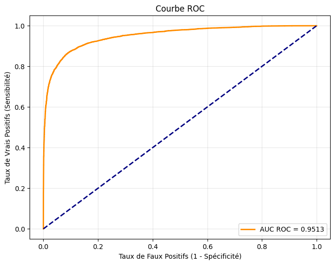
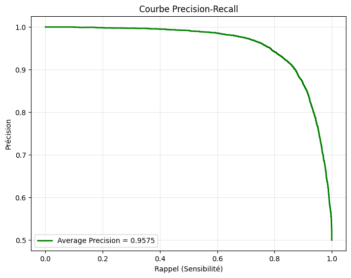
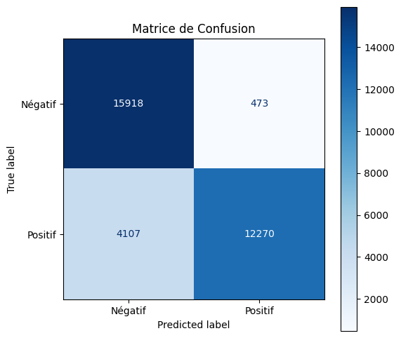
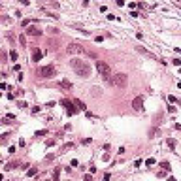
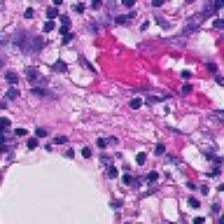
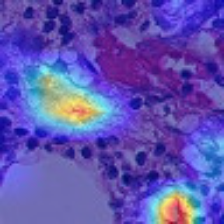

# Rapport d'Évaluation : Classification de Tissus Tumoraux (PatchCamelyon)

## 1. Objectif du Projet

Ce projet a pour but d'automatiser la détection de métastases sur des patchs d'images histopathologiques provenant de ganglions lymphatiques (dataset PatchCamelyon), à l'aide d'un modèle d'apprentissage profond (ResNet50).

## 2. Synthèse des Performances Médicales

Les résultats ci-dessous reflètent les performances du meilleur modèle évalué sur le **jeu de données de test** (données non vues pendant l'entraînement ni la sélection du modèle) :

- **AUC ROC** : `0.9513` — Capacité globale à distinguer les cas positifs des négatifs
- **Average Precision (PR AUC)** : `0.9575`
- **Exactitude (Accuracy)** : `0.8602`
- **Sensibilité (Rappel)** : `0.7492` — Capacité à bien détecter les vrais positifs
- **Spécificité** : `0.9711` — Capacité à rejeter correctement les faux positifs
- **Précision** : `0.9629`

## 3. Visualisations Cliniques

### Courbe ROC

*La courbe ROC illustre le compromis entre la sensibilité (taux de vrais positifs) et le taux de faux positifs. AUC = 0.9513.*

### Courbe Précision-Rappel

*Particulièrement utile si les classes sont déséquilibrées, elle montre le compromis entre précision et rappel. AP = 0.9575.*

### Matrice de Confusion

*Visualisation directe du nombre de vrais positifs, vrais négatifs, faux positifs et faux négatifs.*

## 4. Interprétabilité du Modèle (Grad-CAM)

Afin de garantir la transparence et la fiabilité clinique, une analyse de l'explicabilité du modèle a été intégrée via la méthode Grad-CAM (Gradient-weighted Class Activation Mapping).
Ces cartes d'activation permettent d'identifier visuellement les régions tissulaires spécifiques qui ont conduit le modèle à prédire la présence ou l'absence de métastases.

### Vrais Positifs — Le modèle détecte correctement la métastase

| Image Originale | Carte d'Activation Grad-CAM |
| :---: | :---: |
|  |  |
| *Patch avec métastase (correctement détecté)* | *Zones d'intérêt identifiées par le modèle* |

### Faux Négatifs — Le modèle rate la métastase

| Image Originale | Carte d'Activation Grad-CAM |
| :---: | :---: |
|  |  |
| *Patch avec métastase (manqué par le modèle)* | *Le modèle ne se concentre pas sur la zone tumorale* |

### Exemples complets par catégorie

Le dossier `gradcam/` contient 5 exemples de chaque catégorie :
- **TP** (Vrais Positifs) : métastase détectée correctement
- **FP** (Faux Positifs) : tissu sain classé à tort comme métastatique
- **TN** (Vrais Négatifs) : tissu sain classé correctement
- **FN** (Faux Négatifs) : métastase manquée par le modèle

## 5. Analyse des Erreurs

### Faux Négatifs (25.1% des positifs)

La sensibilité de **74.9%** signifie que le modèle manque environ 1 métastase sur 4. L'analyse des Grad-CAM sur les FN montre que :
- Le modèle se concentre souvent sur des régions de stroma plutôt que sur les cellules tumorales.
- Les patches avec des micro-métastases diffuses (sans amas dense) sont les plus souvent manqués.
- Certains patches présentent des artefacts de coloration qui perturbent la décision.

**Impact clinique** : un taux de faux négatifs de 25% est inacceptable pour un outil de screening. En pratique, cela signifie que le modèle ne peut pas être utilisé seul — il nécessiterait une double lecture humaine systématique.

### Faux Positifs (2.9% des négatifs)

La spécificité élevée (97.1%) est un point fort. Cependant, sur un volume important de lames, même 2.9% de faux positifs génère un nombre significatif de cas à revoir inutilement.

### Pistes d'amélioration

1. **Normalisation de coloration** (Macenko/Vahadane) pour réduire les artefacts H&E.
2. **Optimisation du seuil** : abaisser le seuil de 0.5 à une valeur optimisée (Youden's J) améliorerait la sensibilité au prix d'une légère baisse de spécificité.
3. **Augmentations spécifiques** : stain augmentation, augmentations ciblées sur les cas difficiles.
4. **Architecture** : un scheduler de learning rate (cosine, step) pourrait améliorer la convergence.

## 6. Conclusion

Le modèle atteint une AUC ROC de **0.9513** sur le test set, ce qui démontre une bonne capacité de discrimination globale entre tissu sain et métastatique. La spécificité élevée (97.1%) en fait un outil potentiellement utile pour le **pré-screening** : identifier rapidement les lames probablement négatives pour concentrer l'attention du pathologiste sur les cas suspects.

Cependant, la **sensibilité de 74.9% est le point faible principal**. Pour un contexte clinique réel, ce taux de faux négatifs est inacceptable. Les principales causes identifiées sont :
- L'absence de normalisation de coloration H&E.
- Le seuil de décision fixe (0.5) non adapté à l'asymétrie des coûts d'erreur en oncologie (manquer un cancer coûte plus cher qu'une fausse alarme).
- Un budget d'entraînement limité (GPU Colab gratuit).

Ce projet reste un travail de portfolio qui démontre la maîtrise d'un pipeline complet de deep learning médical : données, modèle, évaluation rigoureuse, interprétabilité, et documentation honnête des limites.
